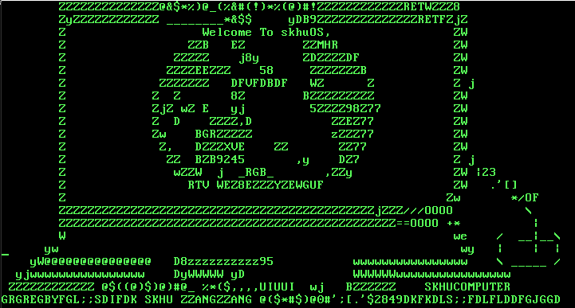
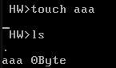
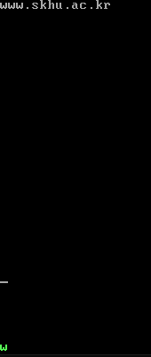
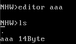

# 💻 skhuOS — Intel x64 기반 범용 운영체제



> `multiTasking` 명령어 실행 화면 — 24개 프로세스가 타이머 인터럽트 기반 선점형 스케줄링으로 동시에 실행됩니다.

## 📌 프로젝트 개요

- **프로젝트 내용**: Intel x64 확장 프로세서 기반의, 밑바닥부터 만드는 간단한 범용 운영체제
- **프로젝트 목적**: 운영체제 코어 및 컴퓨터 구조에 대한 깊은 이해도 향상
- **사용 기술**: `C`, `NASM Assembly`
- **타깃 환경**: x86_64 (QEMU 가상머신에서 부팅)
- **제작 시기**: 2022년 학부 캡스톤 디자인

### 구현 범위 한눈에 보기

BIOS 부팅부터 셸 위에서 텍스트 에디터를 실행하기까지, 아래 전 과정을 직접 구현했습니다.

| 영역 | 구현 내용 |
| --- | --- |
| 부팅 | 512B 부트로더, 16 → 32 → 64비트 모드 전환 (GDT · A20 · CR0/CR3/CR4/EFER) |
| 메모리 | PML4 4단계 페이지 테이블 (4KB 페이지, 커널/응용 영역 분리) |
| 인터럽트 | IDT · PIC 초기화, TSS/IST 기반 컨텍스트 저장/복원 |
| 프로세스 | PCB · 라운드 로빈 선점형 스케줄러(5ms) · CAS 기반 재진입 뮤텍스 |
| 드라이버 | 키보드(8042) · 타이머(PIT 8253) · 디스크(ATA PIO, LBA) |
| 파일 시스템 | FAT 구조 커스텀 파일 시스템 (포맷 · 마운트 · 생성 · 삭제) |
| 응용 | 대화형 셸 + 텍스트 에디터 |

---

## 🗂 프로젝트 구조

```text
skhuos/
├── boot/              # 16비트 부트섹터 (BIOS, INT 13h 확장 LBA 읽기)
│   └── BootLoader.asm
├── loader/            # 32비트 브릿지 (Protected Mode 진입 + 페이지 테이블 준비)
│   ├── Entry.s, Main.c, Page.c, SwitchToIA32.asm ...
│   └── linker.ld
├── kernel/            # 64비트 커널 본체 (IA-32e Mode)
│   ├── arch/          # CPU 의존 계층: 디스크립터, 인터럽트 스텁, 포트/레지스터 제어, 컨텍스트 스위칭
│   ├── drivers/       # 키보드(8042) · 타이머(PIT) · 디스크(ATA) · PIC
│   ├── fs/            # FAT 구조 커스텀 파일 시스템
│   ├── mm/            # 물리 메모리 비트맵 할당자
│   ├── proc/          # 프로세스 · 스케줄러 · 동기화(뮤텍스)
│   ├── lib/           # 큐 · 연결 리스트 등 커널 자료구조
│   ├── shell/         # 대화형 셸 · 텍스트 에디터
│   ├── Main.c         # 커널 초기화 진입점
│   └── linker.ld
├── common/            # loader와 kernel이 공유하는 코드 (Type, Paging, Print, String, util)
├── tools/
│   └── imagemaker/    # boot + loader + kernel → Disk.img 생성 도구
├── docs/images/       # README 데모 스크린샷
├── run.bat            # 빌드 + QEMU 실행 원클릭 (Windows + WSL)
└── Makefile           # 단일 통합 빌드 (산출물은 전부 build/ 아래 생성)
```

디렉터리가 부팅 단계(`boot` → `loader` → `kernel`)와 1:1 대응되고, 커널 내부는 서브시스템(아키텍처 의존 계층 / 드라이버 / 파일 시스템 / 메모리 / 프로세스)별로 나뉩니다. 단계별 바이너리는 `imagemaker`가 하나의 디스크 이미지로 합칩니다.

### 구조 설계 근거

- **디렉터리 = 부팅 단계 = 디스크 이미지 레이아웃.** 최상위 세 디렉터리의 순서가 곧 부팅 순서이자 `Disk.img`의 물리 배치(부트섹터 1개 → loader → kernel)입니다. 저장소 구조만 보고도 부팅 흐름과 이미지 구성이 읽히는 것을 최우선 기준으로 삼았습니다.
- **"32비트 커널"이 아니라 `loader`.** 32비트 단계의 실제 책임은 페이지 테이블 준비와 64비트 커널의 복사·점프가 전부입니다. 관례적인 "Kernel32" 대신 실제 역할대로 로더라고 이름 붙여, 처음 코드를 여는 사람이 잘못된 기대를 갖지 않게 했습니다.
- **커널 include에 서브시스템 경로를 명시.** 커널 내부 include는 `#include "drivers/Disk.h"`처럼 계층을 드러냅니다. 어떤 모듈이 어떤 계층에 의존하는지 include 문만으로 보이고, CPU 의존 코드(`arch/`)와 그 위의 정책 코드가 구분됩니다. 예외는 `common/`뿐입니다.
- **`common/`의 기준은 "공용 유틸"이 아니라 빌드 제약.** 32비트(loader)와 64비트(kernel) 양쪽으로 컴파일되는 코드만 이곳에 둡니다. "이 코드는 두 번 컴파일된다"는 제약이 디렉터리 위치로 드러납니다.
- **단일 non-recursive Makefile + `build/` 격리.** 재귀 make는 디렉터리 간 의존 그래프가 끊겨 불완전 빌드가 생기기 쉽습니다. 전체 의존성을 한 파일이 소유하게 하고, "loader는 `Main.o`가 링크 선두(0x10200), kernel은 `Entry.o`가 선두(0x600000)" 같은 부팅이 걸린 링크 순서 불변식도 같은 자리에서 보장합니다. 산출물은 소스 트리 밖 `build/`에만 생성되어, 과거 겪었던 산출물 자기참조류 사고를 구조적으로 차단합니다.
- **부트섹터 메타데이터는 시그니처 블록으로.** 빌드 도구가 부트로더의 "오프셋 5"를 안다는 암묵적 약속 대신, `SKHUBOOT` 시그니처가 붙은 명시적 BootInfo 블록을 두고 기록자(`imagemaker`)와 소비자(loader)가 모두 시그니처 스캔으로 위치를 찾습니다. 블록 레이아웃은 `common/BootInfo.h` 한 곳에서만 정의됩니다.

---

## 🚀 빠른 실행 (Windows + WSL)

저장소 루트의 `run.bat` 하나로 빌드부터 QEMU 부팅까지 한 번에 진행됩니다.

1. (최초 1회) WSL Ubuntu에 의존성을 설치합니다.

   ```bash
   sudo apt install make nasm gcc gcc-multilib qemu-system-x86 qemu-utils
   ```

2. `run.bat`을 실행하면 전체 빌드 → `Disk.img`/`HDD.img` 생성 → QEMU 부팅이 자동으로 진행됩니다.
3. 부팅 후 셸 프롬프트에서 `help`를 입력하면 사용 가능한 명령어 목록이 출력됩니다. 파일 시스템 명령어는 포맷·마운트가 선행되어야 합니다 — [터미널 셸 명령어](#6-터미널-셸-명령어-shell-commands) 참고.

Linux 환경이라면 아래 [소스에서 빌드](#-소스에서-빌드) 절차를 그대로 사용하면 됩니다.

---

## 🛠 소스에서 빌드

### 의존성

Linux 또는 WSL 환경 기준이며, Ubuntu 설치 명령은 [빠른 실행](#-빠른-실행-windows--wsl) 1번과 같습니다.

- `make`, `nasm`
- `gcc` — Makefile은 Linux 네이티브 gcc/ld/objcopy를 사용합니다. 다른 툴체인을 쓴다면 루트 Makefile의 `CC`/`LD`/`OBJCOPY` 변수만 바꾸면 됩니다.
- `qemu-system-x86_64` (실행용)

### 빌드

저장소 루트에서 `make` 한 번이면 됩니다. 모든 산출물은 소스 트리 밖 `build/` 디렉터리에 생성됩니다.

```bash
make          # boot → loader → kernel → imagemaker → build/Disk.img
make clean    # build/ 전체 삭제
```

### 실행 (QEMU)

부팅은 하드디스크(`Disk.img`, hda)로 하고, 파일 시스템 명령어(`formatting`, `mount` 등)는 두 번째 하드디스크(hdb)를 대상으로 하므로 HDD 이미지를 함께 연결해야 합니다.

```bash
qemu-img create -f raw build/HDD.img 20M                           # 최초 1회
qemu-system-x86_64 -m 64 -hda build/Disk.img -hdb build/HDD.img -boot c
```

---

## 🏗 시스템 아키텍처 및 세부 기능

### 1. 부팅 (Booting)

64비트 모드로 진입하기 위해 다음의 4단계를 거칩니다.

> **전원 인가** ➡ **BIOS (부트로더 실행)** ➡ **Real-Address Mode (16비트)** ➡ **Protected Mode (32비트)** ➡ **IA-32e Mode (64비트)**

- **BIOS 및 부트로더 (0x7C00)**: `INT 13h` 확장 읽기(AH=0x42, LBA)로 디스크에서 OS 이미지를 읽어 메모리에 적재 후 Real-Address Mode로 전환. VGA 비디오 메모리(0xB800)를 제어해 부팅 과정을 출력.
- **Real-Address Mode**:
  - 세그먼트 디스크립터(GDT)를 설정하여 물리 메모리 0~4GB 영역 매핑.
  - 시스템 컨트롤 포트(0x92)를 제어하여 **A20 게이트 활성화** (20번째 주소 비트 해제).
  - `CR0` 레지스터의 PE 필드를 1로 설정하여 Protected 모드로 전환.
- **Protected Mode**:
  - 4KB 단위의 페이지 테이블(PML4 구조) 구성. 커널 영역(32MB)과 응용 프로그램 영역을 분리.
  - `CR4`(PAE 활성화), `CR3`(PML4E 주소 지정), `IA32_EFER` 레지스터 설정 후 IA-32e(64비트) 모드로 진입.

<details>
<summary>GDT 및 Paging 설정 코드 보기</summary>

```nasm
; GDT (Global Descriptor Table) 설정 예시
gdtr:
    dw gdtEnd - gdt - 1
    dd gdt + 0x10000 - $$
gdt:
    dq 0x0000000000000000 ; Null Descriptor
    ; Data / Code Descriptors 생략...
gdtEnd:
```

```c
// Page Table 설정 (4KB 단위)
PtEntry * ptEntry = (PtEntry *)PTABLE_BASE_ADDRESS;

// 커널 영역 (Valid)
for (int i = 0; i < KERNEL_SIZE * 512; i++) {
    int physicalAddress = i * 0x1000;
    ptEntry[i].lower4Byte = PAGE_LOWER4B_FLAGS_P | PAGE_LOWER4B_FLAGS_RW | physicalAddress;
    ptEntry[i].upper4Byte = ((physicalAddress >> 28) & 0xFF);
}
```

</details>

### 2. 인터럽트 및 예외 처리 (Interrupts/Exceptions)

- **IDT (Interrupt Descriptor Table)**: Interrupt Gate를 사용하여 다중 인터럽트 방지 및 컨텍스트 스위칭 간소화.
- **PIC (Programmable Interrupt Controller)**: 마스터/슬레이브 PIC 초기화 및 IRQ 라우팅. 폴링 방식의 비효율성을 극복하고 이벤트 기반의 하드웨어 제어 구현.
- **Context Saving/Loading**: 인터럽트 발생 시 레지스터 상태를 TSS(Task State Segment) 기반 스택에 저장(`SAVEREG`)하고 복원(`LOADREG`).

<details>
<summary>SAVEREG 매크로 코드 보기 (Handler.asm)</summary>

```nasm
%macro SAVEREG 0
    push r15
    push r14
    push r13
    push r12
    push r11
    push r10
    push r9
    push r8
    push rbp
    push rdi
    push rsi
    push rdx
    push rcx
    push rbx
    push rax

    mov ax, ds
    push rax
    mov ax, es
    push rax
    push fs
    push gs

    mov ax, 0x08      ; 커널 데이터 세그먼트로 전환
    mov ds, ax
    mov es, ax
    mov gs, ax
    mov fs, ax
%endmacro
```

</details>

### 3. 디바이스 드라이버 (Device Drivers)

1. **키보드 드라이버**: 8042 컨트롤러 ➡ PIC ➡ CPU 흐름으로 스캔 코드를 수신. 원형 큐를 구현하여 스캔 코드를 버퍼링하고 아스키 코드로 변환하여 화면에 출력.
2. **타이머 드라이버 (PIT 8253)**: Mode 2를 사용하여 일정 시간마다 주기적으로 인터럽트가 발생하도록 구성. 이를 기반으로 **Round Robin 스케줄링** 구현.
3. **디스크 드라이버**: HDD 컨트롤러와 통신. LBA(Logical Block Addressing) 방식을 사용하여 지정된 섹터/실린더/헤드에서 블록 단위의 I/O 읽기/쓰기 구현.

### 4. 프로세스 및 스케줄링 (Process Management)

- **PCB (Process Control Block) 기반 관리**: PID, 페이지 테이블 주소, 스택 정보, Context(레지스터) 정보를 담은 PCB 구조체 설계.

<details>
<summary>PCB 구조체 보기 (Process.h)</summary>

```c
#pragma pack(push, 1)
typedef struct processContext {
    QWORD reg[24];          // GS/FS/ES/DS, RAX~R15, RIP, CS, RFLAGS, RSP, SS
} ProcessContext;

typedef struct pcb {
    Node link;              // 스케줄러 LinkedList의 연결 노드 (id == pid)
    QWORD * pageTableAddress;
    QWORD stackSize;
    QWORD * stackAddress;
    ProcessContext context;
} PCB;

typedef struct processScheduler {
    PCB * runningProcess;
    LinkedList processList;
} ProcessScheduler;
#pragma pack(pop)
```

</details>

- **스케줄링 (Round Robin)**:
  - PIT 인터럽트를 통해 5ms 단위로 선점형 멀티태스킹 수행.
  - 큐 기반 스케줄러를 구성하여, 타이머 만료 시 또는 자발적 양보(Yield) 시 컨텍스트 스위칭(`switchContext`) 발생.

<details>
<summary>schedule() 코드 보기 (Process.c)</summary>

```c
void schedule(void) {
    bool preIf = setIf(FALSE);              // 인터럽트 잠시 차단

    if (scheduler.processList.count == 0) {
        setIf(preIf);
        return;
    }

    PCB *nextProcess = (PCB *)HeadRemove(&(scheduler.processList));

    if (nextProcess != NULL) {
        PCB *curProcess = scheduler.runningProcess;
        insertList(&(scheduler.processList), curProcess);  // 현재 프로세스를 큐 꼬리로
        scheduler.runningProcess = nextProcess;
        switchContext(&(curProcess->context), &(nextProcess->context));
    }
    setIf(preIf);
}
```

</details>

- **동기화 (Synchronization)**: 공유 자원 보호를 위해 원자적 연산(CAS; Compare-And-Swap)을 활용한 Mutex(뮤텍스) 락 구현 (재진입 가능 구조).

<details>
<summary>Mutex 구현 코드 보기 (Sync.c)</summary>

```c
void initMutex(Mutex * mutex) {
    mutex->available = TRUE;
    mutex->count = 0;
    mutex->pid = -1;
}

void acquireLock(Mutex * mutex) {
    int currentPid = getRunningPid();

    // 재진입: 동일 프로세스가 이미 보유한 락이면 카운트만 증가
    if (mutex->available == FALSE && mutex->pid == currentPid) {
        mutex->count++;
        return;
    }

    // CAS: available이 TRUE일 때만 FALSE로 원자적 교환. 실패 시 yield
    while (__sync_bool_compare_and_swap(&(mutex->available), TRUE, FALSE) == FALSE) {
        schedule();
    }
    mutex->pid = currentPid;
    mutex->count = 1;
}

void releaseLock(Mutex * mutex) {
    int currentPid = getRunningPid();

    if (mutex->pid != currentPid || mutex->available == TRUE) {
        return;
    }

    mutex->count--;

    if (mutex->count == 0) {
        mutex->pid = -1;
        __sync_synchronize();        // 메모리 배리어: pid 클리어 후 release 보장
        mutex->available = TRUE;
    }
}
```

</details>

### 5. 파일 시스템 (File System)

Windows의 FAT 파일 시스템을 모방한 커스텀 파일 시스템을 구축했습니다. 디스크를 세 영역으로 나눕니다.

1. **BR 영역**: 파일 시스템의 메타 정보 (FAT 시작 위치, Data 주소 등).
2. **FAT 영역**: 클러스터 링크 테이블 저장 (파일의 단편화 추적).
3. **Root Directory**: 파일 메타데이터 (이름, 용량, 시작 클러스터) 저장.

### 6. 터미널 셸 명령어 (Shell Commands)

OS 상호작용을 위해 기본적인 셸과 명령어 체계를 구축했습니다.

| 명령어 | 기능 설명 |
| --- | --- |
| `help` / `clear` / `reboot` | 명령어 목록 출력 / 화면 지우기 / 시스템 재부팅 |
| `diskCapacity` / `memUsed` | 물리 디스크 용량 출력 / 메모리 사용량 출력 |
| `formatting` / `mount` | 디스크를 FAT 구조로 포맷 / OS에 마운트 |
| `ls` / `touch` / `rm` | 디렉터리 목록 조회 / 빈 파일 생성 / 파일 삭제 |
| `multiTasking` | 멀티태스킹 데모 시각화 (24개 프로세스 동시 실행) |
| `editor [name]` | 간단한 텍스트 에디터 실행 및 저장 |

#### 파일 시스템 사용 전 필수 단계

`ls`, `touch`, `rm`, `editor` 등 파일 시스템 명령어를 사용하기 전에 반드시 다음을 먼저 실행해야 합니다.

| 순서 | 명령어 | 설명 |
| --- | --- | --- |
| 1 | `formatting` | 디스크를 FAT 구조로 포맷합니다. **수 분 소요될 수 있습니다.** |
| 2 | `mount` | 포맷팅된 디스크를 OS에 마운트합니다. |

#### `editor` 사용법

```text
editor <파일명>     # 에디터 진입
ESC → q → Enter    # 저장하지 않고 종료
ESC → w → Enter    # 저장 후 종료
```

---

## 🖥 데모 (Demonstration)

### 1. 선점형 멀티태스킹 (`multiTasking`)

문서 상단의 대표 이미지가 이 명령어의 실행 화면입니다.

- 총 24개의 프로세스가 동시에 생성되며, 각 줄마다 하나의 프로세스가 할당됩니다.
- 타이머 인터럽트를 통해 컨텍스트 스위칭이 일어나며 좌측부터 우측으로 순차적으로 문자가 출력됩니다.

### 2. 파일 생성 및 텍스트 에디터 (`touch`, `editor`)



- `touch aaa` 명령어로 0 Byte 파일을 생성하고 `ls`로 확인합니다.



- `editor aaa`를 통해 에디터 화면으로 전환 후 `www.skhu.ac.kr`를 입력 및 저장(ESC → w)합니다.



- 다시 `ls`를 입력하면 `aaa` 파일의 크기가 디스크에 쓰여 14 Byte로 정상 증가한 것을 확인할 수 있습니다.

---

## 🚧 한계와 향후 과제

학습용 OS로서 의도적으로 단순화한 부분과, 그 확장 방향을 명확히 인지하고 있습니다.

| 한계 | 현재 상태 | 확장 방향 |
| --- | --- | --- |
| 특권 분리 없음 | 모든 코드가 Ring 0에서 동작, 특권 전환을 동반하는 시스템 콜 부재 | DPL3 세그먼트 + 페이지 U/S 비트 + `syscall` 진입점 |
| 단일 주소 공간 | identity 매핑, 컨텍스트 스위칭 시 CR3 미교체 | 프로세스별 페이지 테이블 + demand paging |
| Blocked 상태 부재 | 디스크 대기·`sleep`이 busy-wait으로 CPU 소모 | READY/BLOCKED 상태 모델 + 타이머 만료 큐 |
| 단일 코어 | PIC + 인터럽트 차단 기반 동기화 | APIC 전환, 코어별 런큐 |
| 파일 시스템 | 계층 디렉터리·버퍼 캐시·저널링 없음 | 캐시 → 계층 디렉터리 → 저널링 순 도입 |

---

## 💡 회고 및 극복한 점 (Challenges)

1. **메모리 적재 주소 불일치 버그**
   - **증상**: 코드와 변수를 물리 메모리에 직접 적재하는 과정에서 데이터가 엉뚱한 주소에 쓰여, 쓰레기 값 출력 또는 예고 없는 재부팅(트리플 폴트) 발생.
   - **추적**: VGA 출력으로 단계별 체크포인트를 찍어 죽는 지점을 이분 탐색하고, QEMU 메모리 덤프로 기대 주소와 실제 적재 내용을 대조.
   - **원인·해결**: 링커 스크립트가 가정하는 적재 주소와 부트로더가 실제 복사하는 목적지의 불일치. 메모리 맵을 문서로 정리해 일치시키고, 모든 고정 주소를 헤더 상수로 일원화했습니다.
2. **빌드 단계 디스크 이미지 무한 증식 버그**
   - **증상**: 빌드를 돌리면 `Disk.img`가 끝없이 커져 호스트 디스크 1TB를 가득 채움.
   - **원인**: 이미지 생성 도구의 자기참조. 산출물이 입력과 같은 디렉터리에 놓이던 구조에서 이전 빌드의 이미지가 입력 목록에 섞였고, 출력 파일을 자기 입력으로 읽는 순간 "쓴 만큼 다시 읽히는" 루프가 되어(`cat A B > B`와 같은 병리) EOF에 도달하지 못한 채 디스크가 찰 때까지 증식.
   - **해결**: 입력을 명시적 경로로 고정하고 산출물을 소스 트리 밖 `build/`로 분리해 자기참조를 구조적으로 차단. `ImageMaker` 자체에도 stat 기반 입력·출력 동일성 검사를 추가해 코드 레벨 방어를 완성했습니다.
   - **배운 점**: 빌드 도구의 사소한 버그가 호스트 자원 전체를 고갈시킬 수 있으며, 산출물 크기를 기대값과 대조하는 값싼 불변식 검증만 갖춰도 폭주형 버그를 조기에 잡을 수 있습니다.
3. **Bare-metal 환경의 디버깅 한계**
   - 전용 디버거가 없는 환경에서 메모리 덤프와 화면 출력에 의존해 디버깅했습니다. 하드웨어 레지스터에 단 1비트만 잘못 써도 "논리 오류"가 아닌 "재부팅"으로 나타나기 때문에, 재현 가능한 최소 단계와 체크포인트 출력을 먼저 갖추는 것이 디버깅 속도를 결정한다는 것을 배웠습니다.
4. **표준 라이브러리(C Standard Library) 부재**
   - `printf`, `malloc` 등은 모두 OS의 시스템 콜 위에 구현된 것이라 bare-metal에서는 쓸 수 없습니다. VGA 텍스트 메모리(0xB8000) 직접 제어를 통한 화면 출력부터 문자열/메모리 조작 함수까지 직접 구현했습니다.
5. **수년 만의 전수 리팩토링 — "컴파일이 된다"와 "맞는 코드"의 간극**
   - **발견**: 졸업 후 코드를 전수 점검하면서 암시적 함수 선언 탓에 인자 개수가 틀린 호출이 그대로 컴파일되고 있었고, 헤더에 정의된 static 배열이 include하는 파일마다 49KB짜리 사본을 만들고 있었으며, 괄호가 빠진 `if(isOutputBufferFull)`처럼 항상 참인 조건이 잠복해 있었습니다.
   - **해결**: 헤더를 실제 공개 API와 일치시키고 `-Werror=implicit-function-declaration`으로 같은 유형의 문제를 컴파일 단계에서 차단. 문자열만 다른 프로세스 함수 24벌과 인터럽트 스텁 38벌을 함수 테이블과 NASM 매크로로 통합해 약 4,300줄을 3,400줄로 줄였습니다.
   - **배운 점**: 관대한 컴파일 설정의 freestanding 환경에서는 "돌아간다"가 정합성을 보증하지 않으며, 경고를 에러로 승격하고 헤더를 단일 진실 공급원으로 유지하는 것이 사후 디버깅보다 훨씬 저렴합니다.
6. **최신 툴체인으로의 빌드 이전**
   - **증상**: Cygwin 크로스 컴파일러 전제 빌드를 WSL 네이티브 gcc로 이전하자, 최신 gcc의 기본값(PIE, 스택 프로텍터)이 고정 주소 링크를 깨뜨렸고, 구조체 복사의 SSE 자동 벡터화로 파일 생성 명령 실행 순간 #UD(invalid opcode) 예외가 발생.
   - **해결**: `-fno-pie -fno-stack-protector`와 freestanding 커널의 표준 플래그 `-mno-sse -mno-sse2 -mno-mmx -mno-red-zone`을 명시.
   - **배운 점**: bare-metal 코드는 툴체인 기본값 변화에 특히 취약하므로, 가정하는 옵션을 빌드 스크립트에 명시적으로 고정하고 빌드부터 QEMU 실행까지의 절차 전체를 `run.bat`으로 저장소에 코드화해 재현성을 확보했습니다.
7. **부팅 방식 전환이 드러낸 드라이버의 잠복 레이스 버그**
   - **증상**: 부팅을 플로피(CHS)에서 하드디스크 + `INT 13h` 확장 LBA 읽기로 전환하며 검증하던 중, `formatting`이 첫 섹터만 쓰고 무한 대기하고 파일을 만들어도 `ls`에 보이지 않는 문제 발견.
   - **추적**: 디스크 이미지 mtime 관찰로 "느린 것"이 아니라 "멈춘 것"임을 판별 → git 원본 버전에서 같은 증상을 재현해 전환 작업의 회귀가 아닌 기존 잠복 버그임을 분리 → QEMU IDE 트레이스(`--trace ide_sector_write`)로 8섹터 쓰기가 3섹터에서 끊기는 것을 확인.
   - **원인·해결**: 둘 다 ATA 프로토콜의 대기 규정 생략. 1) 명령 발행 전 이전 명령의 BUSY 해제를 확인하지 않아 디바이스가 명령을 무시(커널은 오지 않을 DRQ를 영원히 대기) 2) 멀티섹터 쓰기에서 첫 DRQ만 확인하고 데이터를 연속으로 밀어넣어 플러시 중 보낸 데이터가 유실. 각각 BUSY 해제 대기와 "섹터마다 DRQ 대기" 구조로 수정했습니다.
   - **배운 점**: 과거 환경에서의 정상 동작은 정확성이 아니라 에뮬레이터 타이밍이 우연히 관대했던 것입니다. 하드웨어 프로토콜의 대기 조건은 "지금 돌아가니까"로 생략하면 플랫폼이나 버전이 바뀔 때 레이스로 되돌아옵니다.
